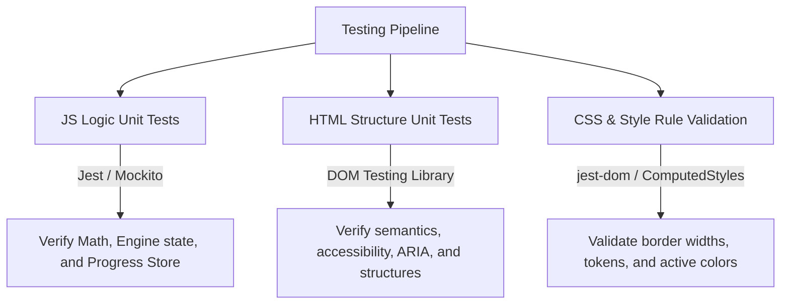

# Modern Front-End Engineering & Quality Standards

This document establishes the official development, UI/UX design, and quality assurance standards for this repository. It incorporates the latest CSS3, HTML5, and ES6+ features introduced by Google and modern web standards, alongside robust testing methodologies to ensure premium performance, visual excellence, and logic correctness.

---

## 🎨 Modern UI/UX Design System (Material 3 & Modern CSS)

We adhere to a minimalist, developer-centric design vocabulary that borrows from **Google's Material Design 3 (M3)** and modern web standards.

### 1. Advanced CSS & Responsive Layouts
* **CSS Grid & Subgrid**: Use Grid for page layouts and `grid-template-rows: subgrid` to align nested cards or headers perfectly along rows, avoiding uneven card heights.
* **Container Queries (`@container`)**: Style components based on the size of their parent container rather than the viewport size (`@media`). This is crucial for reusable cards that behave differently in sidebars versus full-width grids.
  ```css
  .topic-card-container {
      container-type: inline-size;
  }
  @container (max-width: 320px) {
      .topic-card { flex-direction: column; }
  }
  ```
* **CSS Nesting**: Write highly readable stylesheets using native CSS nesting (supported by all modern browsers):
  ```css
  .chapter-accordion {
      background: var(--bg-secondary);
      &:hover { background: var(--bg-hover); }
      &.completed { border-color: var(--accent-emerald); }
  }
  ```
* **Color-Mix (`color-mix()`)**: Create state styles on the fly without declaring separate variables:
  ```css
  border-color: color-mix(in srgb, var(--accent-indigo) 35%, transparent);
  ```

### 2. Micro-interactions & Transitions
* **View Transitions API**: Implement seamless, native animation states when transitioning pages or dynamic views in Single Page Applications (SPA):
  ```javascript
  function transitionToView(viewId) {
      if (!document.startViewTransition) {
          showView(viewId);
          return;
      }
      document.startViewTransition(() => showView(viewId));
  }
  ```
* **Subtle Scales & Springs**: UI elements should respond to pointer events using fast, spring-like easing curves (`cubic-bezier(0.175, 0.885, 0.32, 1.2)` for bounces, `cubic-bezier(0.4, 0, 0.2, 1)` for clean slides). Limit scales to `1.01x` or `1.02x` to prevent jarring layouts.

---

## 🛠️ Pristine JavaScript Architecture

1. **State Isolation**: Never store state inside the DOM. Maintain a single, readable JavaScript object representing application state, and let user interactions update the state object first, which then triggers clean presentational repaints.
2. **Dynamic DOM Manipulation**: Use template literals for compiling repeating elements but always sanitize parameters to prevent XSS vulnerabilities.
3. **Namespace Safety**: Wrap modular components in isolated closures (IIFEs) or native ES Modules (`import`/`export`) to protect the global scope:
  ```javascript
  (function() {
      // Isolated business logic
  })();
  ```

---

## 🧪 Rigorous Testing Standards

Quality assurance in front-end development requires testing not just the core JS business logic, but also validating HTML semantic structure and CSS styling rules.



### 1. JavaScript Logic Unit Testing
Focus on verifying core mathematical engines, utility routines, state persistence, and event dispatches. Mock browser environments (like `localStorage` or `requestAnimationFrame`) to keep tests running at maximum speed.

#### Example: Testing local storage progress saving using Jest
```javascript
import { loadUserProgress, saveUserProgress } from './src/core/curriculum.js';

describe('User Progress Storage Suite', () => {
    beforeEach(() => {
        localStorage.clear();
        jest.clearAllMocks();
    });

    test('should return default empty object when no progress exists', () => {
        const progress = loadUserProgress();
        expect(progress).toEqual({ completedLessons: {} });
    });

    test('should save and reload completed lessons correctly', () => {
        const mockProgress = { completedLessons: { 'lesson-1': true, 'lesson-2': false } };
        saveUserProgress(mockProgress);
        
        const loaded = loadUserProgress();
        expect(loaded.completedLessons['lesson-1']).toBe(true);
        expect(loaded.completedLessons['lesson-2']).toBe(false);
    });
});
```

---

### 2. HTML Structure & Accessibilty (a11y) Unit Testing
Verify that our HTML templates match exact structural schemas, maintain semantic hierarchies, and fulfill accessibility rules. Use **DOM Testing Library** alongside **jest-axe** to automate audits.

#### Example: Testing Tree view nodes structure and accessibility
```javascript
import { screen } from '@testing-library/dom';
import '@testing-library/jest-dom';
import { axe, toHaveNoViolations } from 'jest-axe';

expect.extend(toHaveNoViolations);

describe('Roadmap Tree HTML Semantics Suite', () => {
    let container;

    beforeEach(() => {
        container = document.createElement('div');
        container.innerHTML = `
            <div class="chapter-accordion" role="region" aria-label="Chapter 01">
                <div class="chapter-header" tabindex="0" role="button" aria-expanded="true">
                    <h3>Rectilinear Motion</h3>
                </div>
                <div class="chapter-lessons-list" role="list">
                    <div class="lesson-row-item" role="listitem">
                        <span class="lesson-title-label">Vectors</span>
                    </div>
                </div>
            </div>
        `;
        document.body.appendChild(container);
    });

    afterEach(() => {
        document.body.removeChild(container);
    });

    test('should maintain perfect semantic roles and hierarchies', () => {
        const accordionHeader = screen.getByRole('button', { name: /Rectilinear Motion/i });
        expect(accordionHeader).toBeInTheDocument();
        expect(accordionHeader).toHaveAttribute('aria-expanded', 'true');

        const lessonList = screen.getByRole('list');
        expect(lessonList).toBeInTheDocument();
        expect(screen.getByRole('listitem')).toHaveTextContent('Vectors');
    });

    test('should pass automated accessibility (a11y) validation tests', async () => {
        const results = await axe(container);
        expect(results).toHaveNoViolations();
    });
});
```

---

### 3. CSS & Style Rule Validation Testing
Unit test computed CSS properties to verify that color system tokens are respected, elements use appropriate display modes (like Grid or Flexbox), and interactive elements have precise styling borders.

#### Example: Validating topic card computed styles and dark theme overrides
```javascript
describe('CSS Style Rules Validation Suite', () => {
    let element;
    let styleSheet;

    beforeAll(() => {
        // Inject core styling mock rules
        styleSheet = document.createElement('style');
        styleSheet.textContent = `
            .topic-card {
                background: #11131a;
                border: 1px solid rgba(255, 255, 255, 0.05);
                display: flex;
                flex-direction: column;
                transition: all 0.25s ease;
            }
            .topic-card:hover {
                border-color: #6366f1;
            }
        `;
        document.head.appendChild(styleSheet);
    });

    beforeEach(() => {
        element = document.createElement('div');
        element.className = 'topic-card';
        document.body.appendChild(element);
    });

    afterEach(() => {
        document.body.removeChild(element);
    });

    afterAll(() => {
        document.head.removeChild(styleSheet);
    });

    test('should match design tokens for background and display properties', () => {
        const styles = window.getComputedStyle(element);
        
        // Assert layout displays
        expect(styles.display).toBe('flex');
        expect(styles.flexDirection).toBe('column');

        // Assert token border values
        expect(styles.borderWidth).toBe('1px');
        expect(styles.borderStyle).toBe('solid');
        expect(styles.borderColor).toBe('rgba(255, 255, 255, 0.05)');
    });

    test('should verify correct layout rules exist in CSS text', () => {
        // Assert transitions are specified
        expect(styleSheet.textContent).toContain('transition: all 0.25s ease');
    });
});
```
